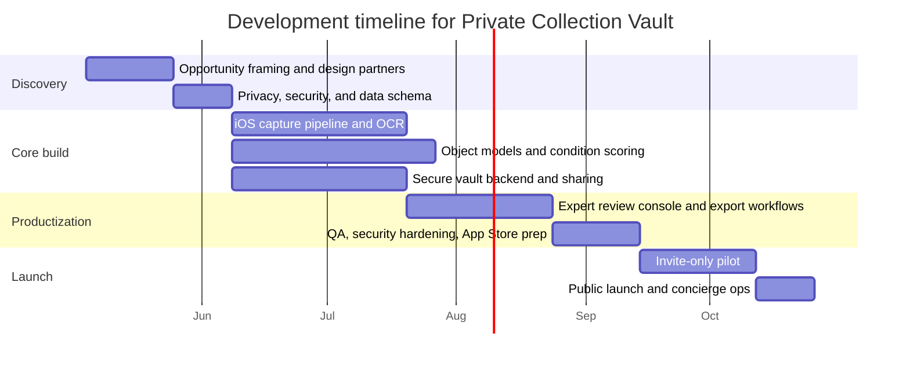
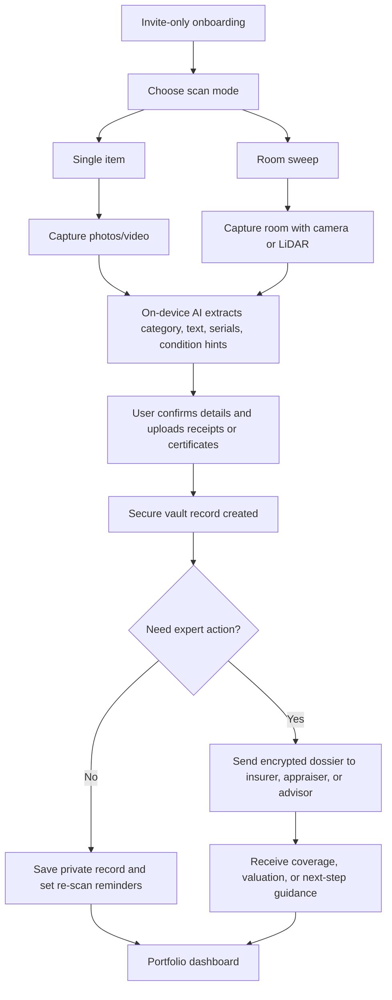

# Best Camera AI iOS App Ideas for Affluent U.S. Users

## Executive summary

The strongest opportunities are not broad “AI lifestyle” apps. They are trust-heavy utilities attached to valuable assets, private spaces, and high-stakes decisions. That is where affluent users already spend, already document, and already pay for expert help. The timing is favorable: North American HNWI wealth rose 8.9% and population 7.3% in 2024, North America is forecast to account for 37% of global UHNW population growth through 2031, luxury demand has polarized toward higher-end buyers and experiences, and next-gen HNWIs increasingly expect digital, personalized, value-added services. citeturn12search6turn12search1turn10search16turn16search0

The best three concepts are **Private Collection Vault**, **Estate Security Lens**, and **Bespoke Closet Twin**. They all use the camera as a primary input rather than a gimmick, can justify recurring revenue, and map cleanly onto modern iPhone capabilities such as Vision image analysis, Core ML on-device inference, ARKit scene understanding, RoomPlan/LiDAR scanning, and secure LocalAuthentication. citeturn2search0turn2search1turn2search5turn3search0turn9search4

The weakest directions are **medical-style wellness diagnostics** and **NFT-first products**. Apple reviews medical claims with high scrutiny, explicitly rejects unsupported phone-only physiological claims such as blood oxygen or blood pressure measurement, restricts marketing use of depth/facial-mapping data, and allows NFT mint/list/transfer only under specific App Store rules where NFT ownership cannot unlock app functionality. Consumer health apps can also fall under the FTC Health Breach Notification Rule even when HIPAA does not apply. citeturn6view3turn6view0turn4search8turn4search5

| Priority | Idea | Best segment | Why it wins | Modeled annual ARPU |
|---|---|---|---|---|
| Best overall | Private Collection Vault | UHNW, HNW | Natural camera workflow, high trust moat, insurance/estate/resale expansion | $800–$3,500 |
| Best premium niche | Estate Security Lens | UHNW, HNW | Very high willingness to pay, clear B2B partner path, strong LiDAR moat | $1,500–$8,000 per residence |
| Best scaled consumer play | Bespoke Closet Twin | HNW, mass affluent | Largest reachable TAM, strong retention, commerce/resale upside | $180–$1,200 |

*Uncertainty note: exclusion of ideas discussed outside this chat is only partially verifiable because prior private history was not available here. Segment cutoffs also vary by source. Cost, timeline, and ARPU figures below are modeled estimates, not quoted market prices.*

## Market context and segment assumptions

Market context from entity["company","Capgemini","consulting firm"], entity["organization","Knight Frank","real estate consultancy"], entity["company","Bain & Company","consulting firm"], entity["company","Deloitte","consulting firm"], and reports published by entity["organization","Art Basel","art fair organization"] and entity["company","UBS","bank"] point to the same pattern: affluent demand is becoming more selective, more experience-led, and more digitally mediated, but still anchored in trust and curation. Absolute luxury remains more resilient than entry luxury, luxury travelers prioritize privacy and premium amenities, and wealthy younger cohorts expect seamless digital engagement plus advisor-like value. citeturn10search16turn10search2turn16search1turn1search19

For this report, the working definitions are: **mass affluent** ≈ **$100,000 to $1 million** in investable/liquid assets, **HNWI** = **$1 million+** in investable assets excluding the primary residence, and **UHNWI** = **$30 million+** net worth. These are standard-enough for strategy work, but they are not perfectly harmonized across institutions. citeturn17search7turn0search4turn0search5

| Segment | What matters most | Best camera-AI wedges |
|---|---|---|
| UHNW | Privacy, protection, documentation, staffing, family-office workflow | Collections, estate security, art placement, cellar intelligence |
| HNW | Personalization, resale value, travel quality, convenience | Collections, wardrobe, purchase verification, travel concierge |
| Mass affluent | Status efficiency, smarter purchases, styling, premium travel | Wardrobe, purchase verification, travel copilot |

The implication is clear: **launch at HNW/UHNW first**, then expand down-market. Bain’s luxury work suggests the resilient spend is at the higher end, while Deloitte’s travel work suggests privacy and premium amenities remain central. Mass affluent buyers are still important, but they are better suited for a second-step offering in fashion, travel, and authentication. citeturn1search1turn10search2turn10search16

## Top app ideas comparison

**Assumptions for ranges below:** 5–7 person senior team, iOS-first, light backend, one ML/CV workstream, no custom hardware, no large enterprise integrations unless noted, and a blended U.S./nearshore build model.

| Rank | Concept summary | Target segment | Core camera + AI features | Monetization | Est. dev time / cost | Regulatory / privacy risk | Competitive differentiation | Modeled annual ARPU |
|---|---|---|---|---|---|---|---|---|
| **Private Collection Vault** | Securely scans art, watches, jewelry, handbags, wine, receipts, and certificates into insurer-, estate-, and resale-ready dossiers | UHNW, HNW | Object recognition, OCR, condition scoring, LiDAR/3D capture, provenance-doc ingestion, secure sharing | Subscription tiers, concierge appraisal, insurer/family-office seats, referral/transaction fees | 6–9 months / $700k–$1.5M | **Medium**: sensitive asset data, authenticity/valuation liability | Cross-category “wealth object OS” rather than single-category app | $800–$3,500 |
| **Estate Security Lens** | LiDAR-powered audit of private homes/estates for blind spots, valuables exposure, access-control gaps, and monitoring coverage | UHNW, HNW | RoomPlan, scene geometry, object/entrypoint detection, AR camera placement, SOP generation | Setup fee, premium subscription, installer/security B2B, annual estate reviews | 7–10 months / $900k–$1.8M | **High**: surveillance, biometrics, false-security assurances | Mobile wedge before hardware sale; affluent estate workflow, not generic alarm UX | $1,500–$8,000 per residence |
| **Bespoke Closet Twin** | Luxury wardrobe digitization, outfit generation, packing, accessory try-on, and resale/auth intake | HNW, mass affluent | Garment segmentation, style embeddings, body/face tracking, color matching, price intelligence | Subscription, stylist upsell, affiliate revenue, resale transaction fees | 5–8 months / $600k–$1.3M | **Medium**: body-image privacy, trademark/IP, counterfeit advice | Luxury-specific fit + resale + concierge, not basic closet organization | $180–$1,200 |
| **Art Placement and Acquisition Advisor** | LiDAR room scan plus AR artwork placement, sizing, lighting fit, and gallery handoff | UHNW, HNW | RoomPlan, AR placement, wall measurement, lighting/color analysis, document OCR | Gallery SaaS, buyer memberships, commissions, concierge sourcing | 5–7 months / $550k–$1.1M | **Medium**: copyright, authenticity/valuation disputes | Buy-side advisory plus in-home visualization | $600–$5,000 |
| **Cellar Intelligence** | Scans wine/spirit labels and cellar layout, tracks provenance docs, fill level, and drink windows | HNW, UHNW | Label OCR, object recognition, shelf mapping, image-based bottle condition checks, LiDAR space mapping | Subscription, auction/storage referrals, transaction fees | 4–6 months / $400k–$850k | **Medium**: alcohol-commerce rules, provenance risk | Private cellar digitization + insurance + concierge, not generic tasting app | $240–$1,500 |
| **VIP Travel Arrival Copilot** | Scans villas, suites, yachts, and documents to personalize arrival, detect issues, and coordinate requests | HNW, mass affluent | Scene understanding, OCR, translation, amenity recognition, real-time enhancement | Subscription, advisor/hotel partnerships, service commissions | 4–6 months / $350k–$750k | **Low–Medium**: location/property privacy, weaker moat | Camera-first stay QA and personalization, not a booking engine | $150–$900 |
| **Wellness Environment Concierge** | Uses camera to assess skin, posture, meals, room setup, and coaching prompts for high-end wellness | HNW, mass affluent | Face/skin imaging, body pose, meal recognition, environment scan, coaching copilots | Subscription, coach/clinic partnerships, upsells | 6–9 months / $750k–$1.6M | **High**: health claims, FTC/HIPAA/App Store scrutiny | “Longevity concierge” angle, but only if claims stay conservative | $200–$2,400 |
| **Luxury Purchase Verifier** | In-store or pre-owned scan for handbags, watches, jewelry, wine, and premium accessories before purchase | HNW, mass affluent | Macro capture, OCR/serials, defect checks, counterfeit risk score, price comps | Freemium scans, pro membership, per-scan fees, retailer/referral fees | 4–7 months / $500k–$1.0M | **Medium–High**: false decisions, brand/legal friction | Pre-purchase risk reduction instead of post-purchase management | $120–$1,000 |

The rank order favors ideas with three properties: a **high-value thing to scan**, a **reason to rescan over time**, and a **downstream action a trusted partner can monetize**. That is why collections, estates, and wardrobes outrank generic luxury inspiration.

## Why the top ideas win

**Private Collection Vault**

This is the cleanest affluent camera workflow. Insurance educators and insurers consistently recommend home inventories, photos of valuables, and special attention to art, jewelry, and collectibles because that speeds claims and helps verify whether coverage is adequate. That makes the value proposition concrete on day one. citeturn18search0turn18search1turn18search15turn18search2

**Recommended MVP**
- Guided scan modes: **single item**, **room sweep**, **document import**
- Category detection for art, watch, jewelry, handbag, wine, furniture
- OCR for receipts, invoices, certificates, serials, insurance schedules
- Risk score: “documentation complete / incomplete,” **not** full valuation
- Exportable PDF dossier for insurer, appraiser, family office, or estate lawyer
- End-to-end encrypted sharing links and re-scan reminders

**Suggested tech stack**
- iOS: SwiftUI, AVFoundation, Vision, Core ML, PDFKit, CryptoKit, LocalAuthentication
- Pro-device path: RoomPlan + ARKit scene depth for room/object context
- Backend: FastAPI or Node, PostgreSQL, S3-compatible object storage, audit logs
- Ops: expert-review web console for appraisers/concierges
- Optional: Apple Foundation Models on supported devices for private summaries and workflow explanations. citeturn15search0turn15search6

**Sample channels / partnerships**
- High-net-worth insurers and brokers
- Family offices and private-client advisors
- Auction houses, galleries, watch/jewelry dealers
- Estate planning and household-management firms

**Estate Security Lens**

Security spend is real, but the right wedge is **audit and orchestration**, not trying to outbuild existing camera vendors. Current players already sell AI video search, live surveillance, and remote monitoring; the opportunity is an affluent iPhone app that enters **before** installation and remains useful for annual reviews, renovations, and incident preparation. citeturn14search2turn14search1turn14search6turn14search18

**Recommended MVP**
- LiDAR-guided scan of entrances, sightlines, and high-value zones
- Blind-spot heatmap and “valuable exposure” detection
- AR overlay recommending camera, lighting, and sensor placement
- Exportable installer brief and estate-manager checklist
- Incident SOP templates for travel mode, staff turnover, and events
- Annual re-audit workflow with before/after comparison

**Suggested tech stack**
- iOS: SwiftUI, ARKit, RoomPlan, RealityKit, Vision, Core ML
- Backend: multitenant org backend with web dashboard
- Security: encrypted local vault + role-based cloud access
- Enterprise: optional integration layer for installer CRM and security vendors

**Sample channels / partnerships**
- Residential security integrators
- Estate managers and luxury property operators
- Architects, custom-home builders, and lighting consultants
- Loss-prevention teams at premium insurers

**Bespoke Closet Twin**

Fashion has the largest scalable consumer TAM, but it is the most crowded segment. Stylebook shows the closet organizer market is mature, Whering claims major user scale, and affluent resale/authentication economics are already proven by major luxury resale and verification players. A viable entrant therefore needs a **luxury wardrobe operating system**, not another organizer. citeturn13search0turn13search15turn10search4turn13search7

**Recommended MVP**
- Closet capture from camera roll and live camera
- Garment segmentation + category/tag auto-fill
- Outfit, occasion, and packing recommendations
- “Should I buy this?” comparison against existing closet
- Resale intake flow for selected items
- Accessory try-on first; full garment try-on later

**Suggested tech stack**
- iOS: SwiftUI, Vision segmentation, Core ML embeddings, ARKit face/body support
- Commerce: product/pricing catalog backend, affiliate link router
- Resale: authentication-intake workflow and structured metadata
- Personalization: on-device ranking first, server-side retrieval later

**Sample channels / partnerships**
- Personal stylists and luxury department stores
- Credit-card premium ecosystems and invite-only memberships
- Luxury resale platforms and authentication services
- Fashion publishers and creator channels focused on affluent buyers

## Technical feasibility and compliance

The current iPhone stack is strong for the core primitives that matter here. Vision handles image/video analysis such as object detection, text recognition, and segmentation; Core ML runs models on-device using CPU, GPU, and Neural Engine resources; ARKit provides motion tracking and scene understanding; RoomPlan converts camera + LiDAR scans into 3D floor plans; sceneDepth is limited to LiDAR-capable hardware; and LocalAuthentication enables Face ID/Touch ID without exposing raw biometric templates to the app. citeturn2search0turn2search1turn2search5turn3search0turn3search10turn9search4

Practically, that means **object recognition, OCR, scene understanding, room scanning, and art/accessory AR** are strong today. Fashion use cases can also lean on face tracking and holistic body-pose support. By contrast, **provenance verification** and **counterfeit detection** should be positioned as hybrid workflows: camera evidence + specialist data + expert review. Specialized vendors such as Entrupy still compete on narrow vertical datasets and strong guarantees, which is a signal that a new app should not promise definitive authentication from images alone. citeturn19search0turn19search1turn13search3turn13search7

The highest-friction compliance areas are clear. Apple requires AR apps to deliver integrated utility, not just drop 3D models into view; subscriptions must provide ongoing value; real-time person-to-person services and physical goods/services can use outside-IAP payment methods under the rules Apple describes; NFT mint/list/transfer is allowed only within specific constraints; and apps in highly regulated fields should be submitted by a legal entity, not an individual developer. citeturn5view0turn6view1turn6view0turn6view2

Privacy is not just a policy page issue; it changes product design. Apple says data collected from depth and facial-mapping tools cannot be used for marketing, advertising, or use-based data mining, Privacy Nutrition Labels and privacy manifests are required, and third-party SDKs now matter directly to submission integrity. For affluent users, the safest product posture is **on-device inference first, cloud sync second, ad-tech never**. citeturn6view3turn7search0turn7search12turn7search1

Health and biometrics are the biggest legal traps. Apple rejects unsupported medical claims, the FTC now makes clear many health apps fall under the Health Breach Notification Rule, HIPAA often does **not** apply to direct-to-consumer apps unless they are offered by or on behalf of covered entities, and Illinois BIPA requires public retention policies, written notice of purpose/duration, and written consent for biometric collection, with a private right of action. Texas enforcement has also shown how expensive biometric cases can become. citeturn6view3turn4search8turn4search5turn20view0turn8news44

**Bottom line on compliance**
- Use **LocalAuthentication/passkeys** for secure login; avoid building your own face database
- Keep wellness claims in the **coaching / habit / environment** lane unless you are prepared for regulated evidence
- Treat NFTs as optional provenance exports at most, not the core product
- If LiDAR matters, either target Pro-tier users explicitly or degrade gracefully on non-Pro devices

## Competitive landscape and go-to-market

Competition exists, but mostly as **point solutions**: entity["company","Sortly","inventory software"] and entity["company","Encircle","property restoration software"] cover inventory, entity["company","ArtPlacer","art visualization software"] covers art AR, entity["company","Entrupy","authentication technology"] and entity["company","The RealReal","luxury resale platform"] cover authentication/resale economics, and entity["company","Verkada","security technology"] and entity["company","Deep Sentinel","security company"] show willingness to pay for AI-powered security workflows. The strategic gap is an affluent-first iPhone workflow that combines **capture, interpretation, and trusted action**. citeturn13search5turn13search1turn13search6turn13search3turn10search4turn14search2turn14search1

Closet apps are the most crowded category. Stylebook has been established for over 15 years and Whering markets itself around 9M+ users, so a new wardrobe app only works if it starts with **luxury fit, authentication intake, resale routing, and stylist/concierge outcomes** rather than generic organization. citeturn13search0turn13search15

Go-to-market should therefore be **trust-led, not ad-led**. Capgemini’s research suggests next-gen HNWIs want digital convenience plus value-added service, which argues for hybrid distribution through family offices, estate managers, premium insurers, galleries, security integrators, travel advisors, stylists, and premium card ecosystems. Deloitte’s luxury-travel work reinforces the importance of privacy and premium amenities, which makes advisor/channel sales more credible than broad paid acquisition. citeturn16search0turn16search1turn10search2

A good commercial rule is simple: monetize **digital utility** with StoreKit subscriptions, monetize **real-world high-touch work** with direct billing where Apple permits it, and use partner revenue only where the partner adds trust. That means appraisals, installations, one-to-one concierge calls, physical services, and enterprise seats are attractive; ad-targeting is not. citeturn6view1

## Development timeline and top-idea experience

The schedule below assumes **Private Collection Vault** as the first product, a small senior team, and an invite-only pilot before wider release.

The critical path is not the AR layer. It is **data quality, trust design, and export workflows**. That is another reason the collection idea outranks more speculative camera-AI concepts.

If choosing only one concept to build first, **Private Collection Vault** is the best balance of affluent willingness to pay, camera-native workflow, partnership potential, and manageable compliance. **Estate Security Lens** is the best premium niche. **Bespoke Closet Twin** is the best scaled consumer bet.